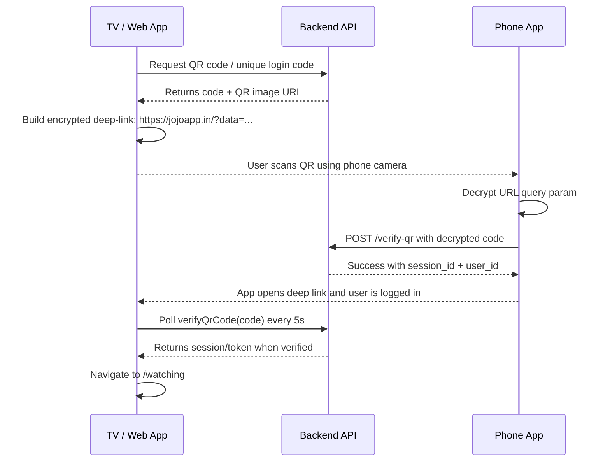

# Use Phone Feature — QR Login Flow

This document captures the exact QR-based "Use Phone" login flow used in this project so it can be reused in another project.

It includes:
- how the QR code is generated on the TV/web app
- how the deep link is encrypted
- how the mobile app decrypts and verifies the link
- how the TV polls for login completion
- the required environment variables and reusable helper functions

---

## 1) High-level flow



---

## 2) Core files used in this project

- TV-side login screen: `src/pages/Auth/UsePhoneView.jsx`
- Encryption helper: `src/utils/encryptAES.js`
- Decryption helper: `src/utils/decryptAES.js`
- QR Redux slice: `src/utils/qrSlice.js`
- Share/deep-link helper: `src/utils/shareLinkCrypto.js`

---

## 3) Required environment variables

Add these to the app environment file:

```env
VITE_SECRET_KEY=your_base64_secret_key
VITE_SECRET_IV=your_hex_iv
```

Example values are expected to match the AES encryption implementation used in the project.

---

## 4) Encryption and decryption helpers

### `src/utils/encryptAES.js`

```js
import CryptoJS from "crypto-js";

export const encryptAES = (plainText, base64Key, hexIV) => {
  try {
    const key = CryptoJS.enc.Base64.parse(base64Key);
    const iv = CryptoJS.enc.Hex.parse(hexIV);

    const encrypted = CryptoJS.AES.encrypt(plainText, key, {
      iv,
      mode: CryptoJS.mode.CBC,
      padding: CryptoJS.pad.Pkcs7,
    });

    return encrypted.ciphertext.toString(CryptoJS.enc.Hex);
  } catch (error) {
    console.error("AES encrypt failed:", error);
    return "";
  }
};
```

### `src/utils/decryptAES.js`

```js
import CryptoJS from "crypto-js";

export const decryptAES = (encryptedHex, base64Key, hexIV) => {
  try {
    const key = CryptoJS.enc.Base64.parse(base64Key);
    const iv = CryptoJS.enc.Hex.parse(hexIV);
    const encrypted = CryptoJS.enc.Hex.parse(encryptedHex);
    const encryptedBase64 = CryptoJS.enc.Base64.stringify(encrypted);

    const decrypted = CryptoJS.AES.decrypt(encryptedBase64, key, {
      iv,
      mode: CryptoJS.mode.CBC,
      padding: CryptoJS.pad.Pkcs7,
    });

    return decrypted.toString(CryptoJS.enc.Utf8);
  } catch (error) {
    console.error("AES decrypt failed:", error);
    return "";
  }
};
```

---

## 5) Deep-link generation logic

This helper creates a URL like:

```text
https://jojoapp.in/?data=<encrypted_hex>
```

### `src/utils/shareLinkCrypto.js`

```js
import { encryptAES } from "./encryptAES";
import { decryptAES } from "./decryptAES";

const base64Key = import.meta.env.VITE_SECRET_KEY;
const hexIV = import.meta.env.VITE_SECRET_IV;

export function generateEncryptedShareUrl(asset) {
  if (!asset?.asset_id || !asset?.asset_type || !asset?.name_analytics) {
    return "";
  }

  const payload = {
    path: asset.asset_id,
    type: asset.asset_type,
    nameAnalytic: asset.name_analytics,
  };

  try {
    const json = JSON.stringify(payload);
    const encryptedHex = encryptAES(json, base64Key, hexIV);
    return `https://jojoapp.in/?data=${encryptedHex}`;
  } catch (error) {
    return "";
  }
}

export function parseDeeplink(encryptedHex) {
  try {
    const decrypted = decryptAES(encryptedHex, base64Key, hexIV);
    if (!decrypted || (typeof decrypted === "string" && !decrypted.trim())) {
      return null;
    }

    const parsed = typeof decrypted === "string" ? JSON.parse(decrypted) : decrypted;
    return parsed?.path ? parsed : null;
  } catch (err) {
    return null;
  }
}
```

### Reusable pattern for login QR

For the TV login flow, the payload is different from asset sharing:

```js
const payload = { qr_code: code };
const encrypted = encryptAES(
  JSON.stringify(payload),
  import.meta.env.VITE_SECRET_KEY,
  import.meta.env.VITE_SECRET_IV
);

const fullLoginLink = `https://jojoapp.in/?data=${encrypted}`;
```

This is the QR payload shown to the user.

---

## 6) TV-side QR screen logic

### File: `src/pages/Auth/UsePhoneView.jsx`

This is the main implementation.

```js
const decryptScannedQR = (encryptedHex, base64Key, hexIV) => {
  try {
    const key = CryptoJS.enc.Base64.parse(base64Key);
    const iv = CryptoJS.enc.Hex.parse(hexIV);
    const encrypted = CryptoJS.enc.Hex.parse(encryptedHex);
    const encryptedBase64 = CryptoJS.enc.Base64.stringify(encrypted);

    const decrypted = CryptoJS.AES.decrypt(encryptedBase64, key, {
      iv,
      mode: CryptoJS.mode.CBC,
      padding: CryptoJS.pad.Pkcs7,
    });

    return JSON.parse(decrypted.toString(CryptoJS.enc.Utf8));
  } catch (e) {
    console.error("❌ Failed to decrypt QR link:", e);
    return null;
  }
};
```

Then the app builds the login deep-link and exposes it in QR form:

```js
const fullLoginLink =
  code && qrUrl
    ? (() => {
        const payload = { qr_code: code };
        const encrypted = encryptAES(
          JSON.stringify(payload),
          import.meta.env.VITE_SECRET_KEY,
          import.meta.env.VITE_SECRET_IV
        );
        return `https://jojoapp.in/?data=${encrypted}`;
      })()
    : "";
```

The QR image is displayed with the app-generated URL:

```jsx
{qrUrl && !loading ? (
  
) : null}
```

---

## 7) Handling the scanned deep link on the TV app

When the app is opened via a mobile deep-link, the `location.search` is inspected:

```js
useEffect(() => {
  const searchParams = new URLSearchParams(location.search);
  const encrypted = searchParams.get("data");

  if (encrypted) {
    const decrypted = decryptScannedQR(
      encrypted,
      import.meta.env.VITE_SECRET_KEY,
      import.meta.env.VITE_SECRET_IV
    );

    if (!decrypted?.code) {
      console.warn("❌ Invalid decrypted QR payload");
      return;
    }

    axios
      .post("/verify-qr", { code: decrypted.code })
      .then((res) => {
        const result = res.data?.data;
        if (result?.session_id && result?.user_id) {
          localStorage.setItem("session_id", result.session_id);
          localStorage.setItem("user_id", result.user_id);
          navigate("/watching");
        }
      })
      .catch((err) => {
        console.error("❌ QR Scan verification failed", err);
      });
  }
}, [location.search, navigate]);
```

This is the key piece that completes the flow when the phone scans the code and opens the app.

---

## 8) Polling logic for verification

The TV app keeps polling the backend with the generated QR code until verification succeeds.

```js
useEffect(() => {
  if (code && !verified) {
    intervalRef.current = setInterval(() => {
      dispatch(verifyQrCode(code)).then((result) => {
        const payload = result?.payload;

        if (
          verifyQrCode.fulfilled.match(result) &&
          payload?.session_id &&
          payload?.token
        ) {
          clearInterval(intervalRef.current);
          localStorage.setItem("session_id", payload.session_id);
          localStorage.setItem("user_id", payload.user_id);
          navigate("/watching");
        }
      });
    }, 5000);
  }

  return () => clearInterval(intervalRef.current);
}, [code, dispatch, verified, navigate]);
```

Why this works:
- The QR code is generated from a unique `code`
- The mobile app decrypts the deep link and sends `code` to `/verify-qr`
- The TV app polls the same code until it gets a verified session/token
- Then it navigates to the authenticated screen

---

## 9) QR generation in the app UI

The QR is displayed in the "Use Phone" screen and includes steps for the user:

```jsx
<div className="text-center w-[40%]">
  <p className="text-start text-white auth-head mb-10">
    Scan the QR Code using your phone or tablet’s camera
  </p>

  {qrUrl && !loading ? (
    
  ) : !loading && !qrUrl ? (
    <div className="text-red-400">Failed to load QR</div>
  ) : null}
</div>
```

The user instructions on the screen are also part of the flow:

- Open the JOJO app on phone
- Go to Profile
- Select TV Login
- Enter the unique code

---

## 10) Reusable implementation checklist for another project

Use this checklist when porting the logic:

1. Create a secure AES helper for encryption/decryption.
2. Keep secret keys in environment variables.
3. Generate a unique QR code value on the TV/web side.
4. Build a deep-link URL with encrypted payload: `?data=<encrypted>`.
5. Convert that URL into a QR image.
6. On the mobile app, parse `?data` from the URL.
7. Decrypt the payload and extract the `code`.
8. Call backend verification (`/verify-qr` or similar).
9. Save session data to local storage or secure storage.
10. On the TV/web side, poll `verifyQrCode(code)` until success.
11. Redirect to the authenticated screen after success.

---

## 11) Example mobile deep-link flow

```js
const url = new URL(window.location.href);
const encrypted = url.searchParams.get("data");

if (!encrypted) return;

const decrypted = decryptAES(encrypted, SECRET_KEY, SECRET_IV);
const payload = JSON.parse(decrypted);

if (payload.qr_code) {
  api.post("/verify-qr", { code: payload.qr_code })
    .then((res) => {
      const { session_id, user_id } = res.data.data;
      localStorage.setItem("session_id", session_id);
      localStorage.setItem("user_id", user_id);
      navigate("/home");
    });
}
```

This is the core logic used for the phone-based login experience.

---

## 12) Summary

The Use Phone flow is built around a secure encrypted deep link and a unique QR code. The TV app generates the QR, the phone decrypts and verifies it via API, and the TV app eventually confirms session establishment by polling the same code.

This pattern is portable to any app that needs:
- QR login with mobile device support
- deep-link verification
- secure payload transmission
- TV/web + phone UX synchronization

---

## 13) Related implementation reference in this project

- TV login screen: `src/pages/Auth/UsePhoneView.jsx`
- QR verification slice: `src/utils/qrSlice.js`
- AES encryption: `src/utils/encryptAES.js`
- AES decryption: `src/utils/decryptAES.js`
- Share / deep-link helper: `src/utils/shareLinkCrypto.js`

If you want, this can also be expanded into a version that is fully framework-agnostic and reusable for React Native, Flutter, or plain JavaScript apps.
